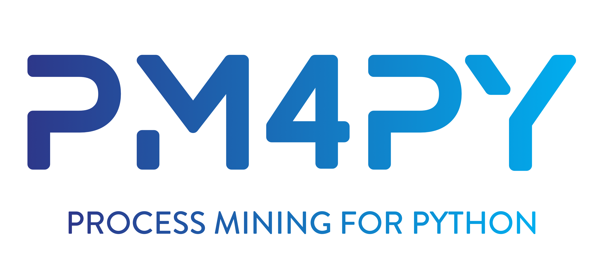
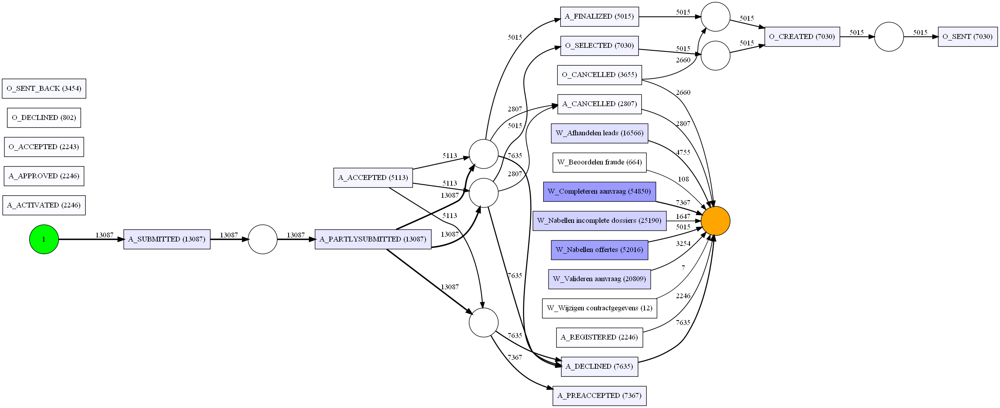
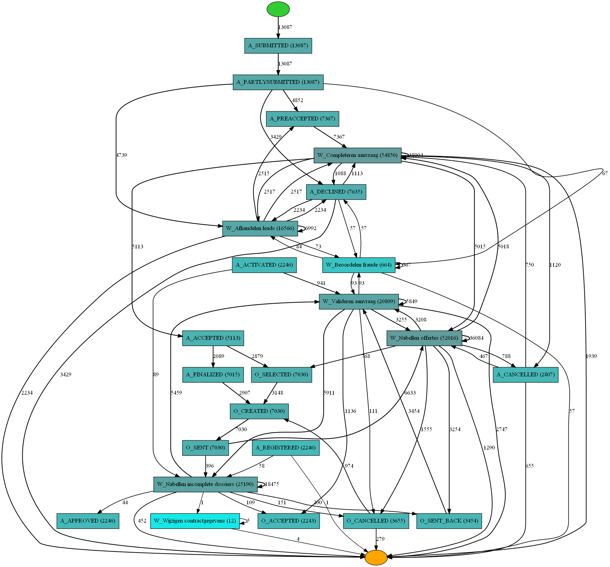
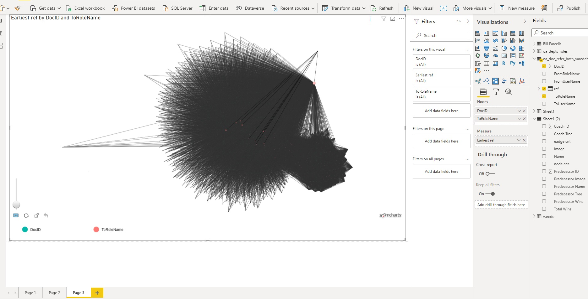
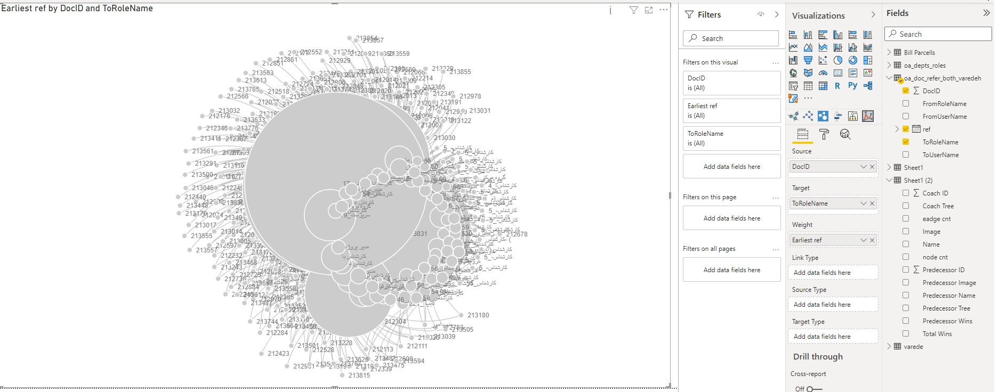
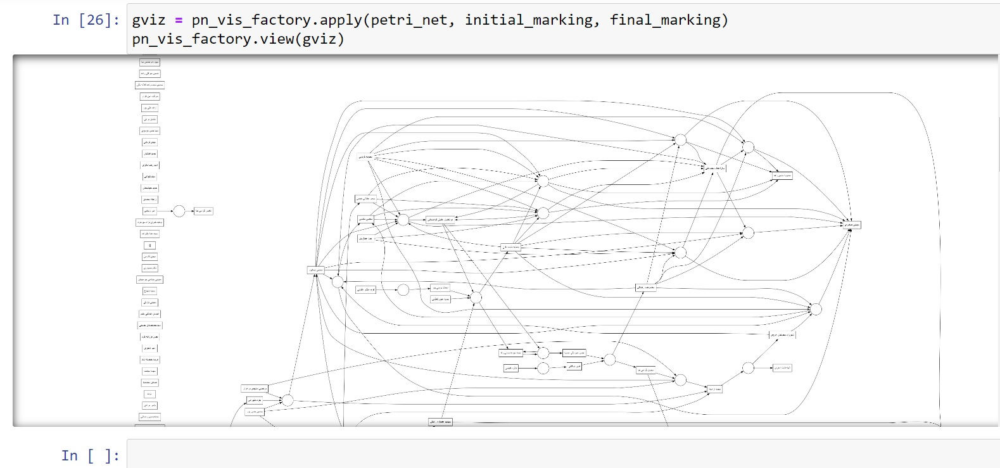

<p align="center">
  
</p>


# Introduction to Process Mining using Python (PM4PY) 😊


Summary
Process mining is a family of techniques in the field of process management that support the analysis of business processes based on event logs. During process mining analysis, a specialized data mining algorithms are applied to the event logs (after transform it) in order to identify trends, patterns and extract insights. Process mining aims to improve process efficiency and the understanding of the processes themselves which in turn help in making better business decisions. It captures the digital footprints from any number of systems throughout an organization and organizes them in a way that shows each step of the journey to complete that process, along with any deviations from the expected path.

**Good luck and feel free to get in touch if you have any question or comments.**

Structure of the document:

The notebooks folder contains the full jupyter notebook. The data folder (raw data) contains the publicly available datasets that is used in this analysis.

**Note: when running the notebook, make sure to change the path to the file.**

Examples of Algorithms used


Alpha Minner algorithm
<p align="center">
  
</p>
Heuristic Minner
<p align="center">
  
</p>
# Process Mining with Python (pm4py)


---

## 📌 Project Overview

This project demonstrates process mining techniques using Python and the **pm4py** library. Process mining helps analyze and visualize event logs to understand, monitor, and improve business processes.

---

## 🏗️ Architecture & Workflow

The project pipeline includes:

1. **Data Loading:**  
   Import event logs in CSV or XES formats.

2. **Data Preprocessing:**  
   Rename columns to standardize keys (e.g., Case ID, Activity, Timestamp).  
   Handle missing data and sort events chronologically.

3. **Conversion:**  
   Convert CSV logs into pm4py event log objects.

4. **Process Discovery:**  
   Apply algorithms (e.g., Heuristic Miner, Alpha Miner) to discover process models.

5. **Visualization:**  
   Visualize the discovered process models and performance metrics.

6. **Performance Analysis:**  
   Extract statistics and detect bottlenecks or deviations.

---

## ⚙️ Installation & Setup

Ensure you have Python 3.8+ installed.

```bash
pip install pm4py pandas matplotlib
````

---

## 🧰 Project Structure

```
process-mining-project/
├── data/
│   └── event_log.csv
├── notebooks/
│   └── process_mining_analysis.ipynb
├── src/
│   └── process_mining.py
├── README.md
└── requirements.txt
```

---

## 🚀 Usage Example

```python
import pandas as pd
from pm4py.objects.log.importer.csv import factory as csv_importer
from pm4py.algo.discovery.alpha import factory as alpha_miner
from pm4py.visualization.petri_net import factory as pn_vis_factory

# Load event log from CSV
log_csv = pd.read_csv('data/event_log.csv')

# Rename columns as needed
log_csv.rename(columns={'DocID':'case:concept:name', 'FromUserName':'concept:name', 'ref':'time:timestamp'}, inplace=True)

# Import CSV to event log object
event_log = csv_importer.apply(log_csv)

# Discover process model using Alpha Miner
net, initial_marking, final_marking = alpha_miner.apply(event_log)

# Visualize Petri net
gviz = pn_vis_factory.apply(net, initial_marking, final_marking)
pn_vis_factory.view(gviz)
```

---

## 📈 Results & Visualization

* Interactive process model diagrams
* Statistics on case duration and activity frequency
* Identification of bottlenecks and process deviations

---

## 📚 References

* [pm4py Documentation](https://pm4py.fit.fraunhofer.de/documentation)
* [Process Mining Manifesto](https://www.win.tue.nl/ieeetfpm/doku.php?id=process_mining_manifesto)
* [Sample Datasets](https://data.4tu.nl/repository/uuid:9f6f0f29-5867-4206-8a1d-ec7c7e381cd2)

---

## 🤝 Contributing

Feel free to fork the repository and submit pull requests. Issues and feature requests are welcome!

---

## 👨‍💻 Author

**Roya Ghasemi Far**
Senior Data Scientist & Process Mining Specialist
[GitHub](https://github.com/roya-ghasemi) | [LinkedIn](https://www.linkedin.com/in/roya-ghasemi)

---

## ⭐️ Support

If you find this project useful, please give it a star ⭐ and share it!

---
**output1 with bugs**
<p align="center">
  
</p>
**output2 with bugs**
<p align="center">
  
</p>
**output3**

<p align="center">
  
</p>
```


